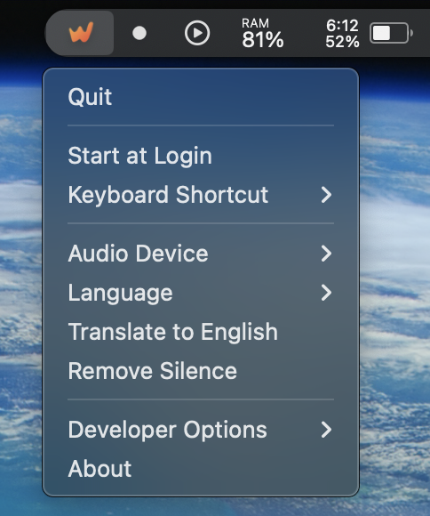

  
  <h1>Whispr</h1>
  
<em>Your voice, your keyboard, no cloud required 🎙️</em>

Whispr is a macOS menubar application written in Rust for local voice-to-text transcription using [Whisper.cpp](https://github.com/ggerganov/whisper.cpp).

## Features

- Push-to-talk (right ⌘ Command key by default)
- Local processing
- Real-time transcription
- Menubar integration
- Configurable input and models
- Remove silence to prevent hallucination

## Usage

1. Launch Whispr
2. Hold right ⌘ Command
3. Speak
4. Release to insert text

## 🛠️ Technical Details

Whispr is built with:
- Tauri v2
- Rust for performance-critical audio and transcription processing
- Whisper.cpp for efficient, local speech recognition
- React + TypeScript for the UI components

## ⚙️ Configuration

Whispr is highly configurable through its settings:

- **Audio Settings**
  - Choose input device
  - Silence removal
  - Recording options

- **Model Options**
  - Multiple Whisper models available
  - Language selection
  - Translation capabilities

- **Developer Features**
  - Save recordings for debugging
  - Enable Whisper logging
  - Detailed configuration options

## Getting Started

1. Download release
2. Launch Whispr
3. Configure settings (optional)
4. Hold right ⌘ Command to speak
5. Right click Whispr menubar to configure

  

## Roadmap

- Model Management
  - [ ] Automated model downloads

- Processing
  - [ ] MLX-powered LLM post-processing
  - [ ] Context-aware improvements

- Integration
  - [ ] Apple Vision API integration
  - [ ] Application context awareness

## Contributing

Open source project - contributions welcome.

## License

MIT License

---

  
Made with ❤️ in Germany together with Claude

